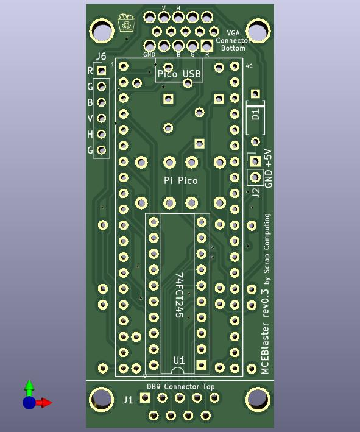
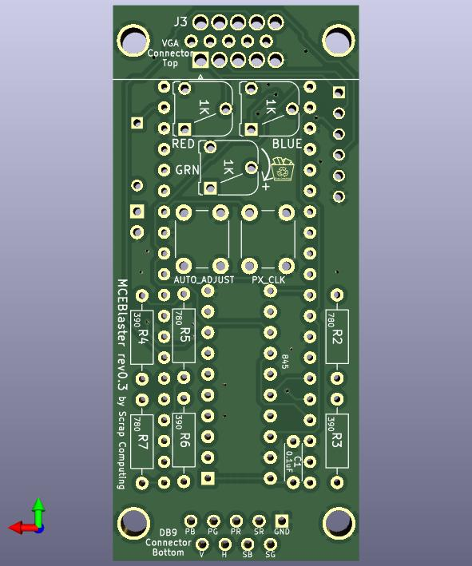

# MCE Blaster

A simple standalone MCA/CGA/EGA to VGA adapter based on a raspberry pi Pico.


# Videos
- MCE Blaster video part 3: https://www.youtube.com/watch?v=SX1B-mfE6yk
- MCE Blaster video part 2: https://www.youtube.com/watch?v=Neg1WR7Hz5s
- MCE Blaster video part 1: https://www.youtube.com/watch?v=kgDOiGoxKvE

# What it does
The Pico reads the TTL input video signal, writes the pixels to a buffer and then generates the VGA signal using the pixels from the buffer.

# Features
- No need for a VGA up-scaler or a 15KHz VGA monitor. Works with standard VGA modes.
- Pixel-perfect output:
  - VGA 640x400 for CGA/EGA 320x200,640x200 and 640x350 inputs
  - VGA 800x600 for MDA 720x350
  - VGA 640x480 for vertical resolutions between 200 and 240
- Pixel clock tuning for each mode
- Auto-adjustment functionality that centers the image on screen
- EGA brown color correction
- On-screen messages
- Through-Hole PCB

# Installing the firmware to the Pico (Pico 1 or Pico 2)
- Download firmware (MCEBlaster_pico1.uf2 or MCEBlaster_pico2.uf2): https://github.com/scrapcomputing/MCEBlaster/releases
- Unplug the Pico
- Press and hold the small "BOOTSEL" button on the Pico
- While holding the BOOTSEL button, connect the Pico to your PC with a micro-USB cable
- The Pico should show up as a mass-storage device
- Copy the `MCEBlaster_pico1.uf2` or `MCEBlaster_pico2.uf2` firmware to the drive associated with the Pico
- Safely eject the mass-storage device

# Usage

*NOTE: Controls have changed since version 0.2!*

## Adjusting the pixel clock
- Push the `PIXEL CLOCK` button once, this will enter the pixel adjust mode. This should show text on screen displaying the current pixel clock.
- Coarse adjustment:
  - Push `PIXEL CLOCK` to increment the pixel clock by 10KHz.
  - Push `AUTO ADJUST` to decrement the pixel clock by 10KHz.
- Fine adjustment:
  - Long-push (push until the push registers) `PIXEL CLOCK` to increment the pixel clock by 1 KHz.
  - Long-push (push until the push registers) `AUTO ADJUST` to decrement the pixel clock by 1 KHz.
  - Medium-push (about half a second push and release) `PIXEL CLOCK` to increment the sampling offset and then increment the pixel clock by 1 KHz once we have tried all offsets.
  - Medium-push (about half a second push and release) `AUTO ADJUST` to decrement the sampling offset and then decrement the pixel clock by 1 KHz once we have tried all offsets.
- Exit pixel clock adjust mode by not pushing any buttons for 12 seconds. This saves the settings to flash.

### Sampling Offset (since rev 0.3)
The sampling offset is a fine-tuning knob added in rev 0.3 that shifts TTL sampling to try to avoid sampling the pixels during the transitions (shown as `X`).
In this example, using a sampling offset of 1 will result in a very noisy image because sampling takes place during the pixel transitions.

```
                    _____ _____ _____ _____
TTL Pixels:        X_____X_____X_____X_____X
Sampling offset 0:      |     |     |     |
Sampling offset 1:       |     |     |     |
Sampling offset 2:        |     |     |     |
Sampling offset 3:         |     |     |     |

```

The reason why offsets are needed and a demonstration of how they work can be found in [video part 3](https://www.youtube.com/watch?v=SX1B-mfE6yk).

## Centering the image
- Push the `AUTO ADJUST` button. This works best when the image shown is full from border to border.

## Print TTL Info (since v0.2)
Long-pressing the `PIXEL CLOCK` button will show a screen with information about the TTL signal.
Note: this is not updated in real-time.

You can exit the screen by pushing any button.

## Manually Setting TTL Options (since v0.2)
By default the MCE Blaster will automatically detect the TTL mode by checking the VSync frequency and the VSync Polarity. If these match the standard MDA/CGA/EGA modes used in PCs this will usually work fine.

But since Version 0.2 the MCE Blaster also supports manually setting:
1. The mode (MDA/CGA/EGA),
2. The horizontal and vertical resolution
3. The horizontal and vertical screen offset (on the TTL side)
with the help of an on-screen menu.

The operation is straight forward:
- To enter the menu long-push both buttons for more than a second until the "MANUAL-TTL" menu shows up.
- The single-line menu consists of 4 items that can be modified. The one that can be currently modified is enclosed in square brackets `[<selected>]`. For example:
```
          Currently
          Selected      Horiz Offset  Vertical Offset
            vvv               vvv      vvv
MANUAL-TTL [CGA] 640 x 200 X: AUTO  Y: AUTO
   ^         ^   ^     ^
On/Off  TTL-mode Horiz x Vertical Resolution
```
the currently selected option is `CGA`.
- Change the value of the selected item with a short push of the buttons.
- Cycle through the items by long-pushing the buttons: one will cycle in one direction and the other in the opposite.
- The options are saved to flash when the user stops pushing buttons for 12 seconds.

## Reset to Factory Defaults (since v0.2)
Occasionally the user may save to flash some configuration that makes the MCE Blaster unusable or inoperable.
In this case you can reset to defaults by pressing both buttons while powering on the device.
Upon a successful reset you will see the LED blinking fast for about 2 seconds.
You can release the buttons after that and the MCE Blaster will start with the default settings.

## Profiles (since v0.3 beta13)
The MCE Blaster supports a number of profiles, which helps when swapping video cards.
The settings for one card can be at Profile 0, the settings for another card can be at Profile 1 etc.
The default profile is Profile 0.

Changing profiles is as easy as long-pressing the `AUTO ADJUST` button and cycling through the profiles with either the `AUTO ADJUST` or the `PIXEL CLOCK` button.

Profiles are demonstrated briefly in [video part 3](https://www.youtube.com/watch?v=SX1B-mfE6yk).

# How it works
## Overview
The first core reads the TTL video data (through the level-shifter) from a PIO state-machine and places the pixels onto a buffer in memory.
The second core works completely independently from the first core and reads the pixel from the buffer and feeds them, along with the necessary Horizontal and Vertical Sync signals to a PIO state machine that writes to GPIO outputs.
The output is converted to analogue with the help of a simple R-2R DAC consisting of two resistors.
Feel free to check out the [video part 1](https://www.youtube.com/watch?v=kgDOiGoxKvE) for a visual overview.

## PIO state machines
The PIO state machines are used not only receiving the TTL video data and writing the VGA video data, but also for other helper functions including:
- Detecting no input signal: This checks if the horizontal sync signal is active.
- Detecting the image offset: This counts the black border pixel until a non-black pixel is found across all lines. This count is used for centering the image automatically.
- The EGA PIO state machine also does the Brown pixel fix because the overhead of doing that in a CPU core was too high.

## Sampling clock
The TTL video input is read by a PIO state-machine (one version for each video mode).
But getting it to sample the pixels at the right time requires us adjust the sampling period in a precise way to match the TTL video card's internal pixel clock.
Using the PIO clock divider does not give us a good-enough precision, because the fractional part of the divider is an 8-bit number, meaning that we get precision of ~0.004ns, but what we really need is about 0.001ns.
So what we do is that we have multiple implementations of the state-machine code, each with a different sampling period and we look for the one that has the lowest division error using the PIO's 8-bit divider.
This process is explained in more detail in the [video part 2](https://www.youtube.com/watch?v=Neg1WR7Hz5s).


# PCB



# Schematic


# Bill Of Materials

Download gerbers: https://github.com/scrapcomputing/MCEBlaster/releases

*NOTE: You can still use the latest firmware with old revisions of the PCB, they are fully compatible.*

Reference      | Quantity     | Value                                                                  | Description
---------------|--------------|------------------------------------------------------------------------|------------
N/A            | 3            | 1K Rm065 through-hole linear potentiometer (optional: can be replaced by a wire between 2 pins as shown on PCB and the [photo below](#potentiometers-are-optional) | Adjust R G B VGA signals
C1             | 1            | 0.1uF disk ceramic capacitor                                           | Decoupling capacitor for level-shifter IC
D1             | 1 (optional) | Diode Through-hole (e.g., Schottky 1N5817 or silicon 1N4001)           | For powering the MCE Blaster from the PC (instead of the Pico's micro-USB)
J2             | 1 (optional) | 1x02 through-hole Male PinHeader 2.54mm                                | For alternative external power
J1             | 1            | DB9 Male Horizontal                                                    | For connecting to TTL video card
J3             | 1            | DB15 Female HighDensity Connector (e.g., Kycon K61X-E15S-NJ-VESA, thanks @wrljet) | For connecting to VGA monitor
R3 R4 R6       | 3            | 390 Ohm Through-hole resistor 1% (alternatively 470 Ohm)               | For VGA signal DAC
R2 R5 R7       | 3            | 780 Ohm Through-hole resistor 1% (alternatively 1K Ohm)                | For VGA signal DAC
SW1,SW2        | 2            | 6mm Through-hole push button                                           | Auto-adjust and pixel-clock buttons
U1             | 1            | 74HCT245 DIP-20 (+ optional socket)                                    | Level-shifter IC
U2             | 1            | RaspberryPi Pico (or Pico 2)                                           | Pi Pico (or Pico 2)
N/A (for Pico) | 2            | 1x20 female through-hole pin-header 2.54mm pitch                       | PCB Pico headers
N/A (for Pico) | 2            | 1x20 male through-hole pin-header 2.54mm pitch                         | Headers for the Pico

## Potentiometers are optional.

They can be replaced by a wire as shown in the photo:


# Build instructions (for developers)
## Requirements:
- C++17 cross compiler (see instructions in https://github.com/raspberrypi/pico-sdk)
- Pico-SDK 2.2.0 or later (https://github.com/raspberrypi/pico-sdk)
- cmake 3.13 or later

## Build for Pico (rp2040) or Pico 2 (rp2350)
```
$ cd firmware && mkdir build && cd build
$ cmake -DPICO_BOARD=<pico|pico2> -DCMAKE_BUILD_TYPE=Release -DPICO_FREQ=270000 -DPICO_SDK_PATH=<path-to-pico-sdk> ../src/
$ make -j
```

# Resources:
- https://minuszerodegrees.net/mda_cga_ega/mda_cga_ega.htm
- https://en.wikipedia.org/wiki/IBM_Monochrome_Display_Adapter
- https://en.wikipedia.org/wiki/Enhanced_Graphics_Adapter
- https://en.wikipedia.org/wiki/Color_Graphics_Adapter
- https://en.wikipedia.org/wiki/VGA_connector

# Similar Projects
- Necroware's [mce-adapter](https://github.com/necroware/mce-adapter)
- [RGBtoHDMI](https://github.com/hoglet67/RGBtoHDMI/wiki)

# Change Log
- Rev 0.1: Initial release.
- Rev 0.2: Major redesign. Manual TTL, menus show live background
- Rev 0.3: Better adjustment of pixel clock with sampling offset, support for Pico 2, and fix colors in some monitors

# License
The project is GPLv2.
