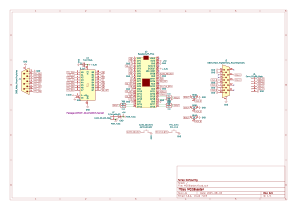

# MCE Blaster

A simple standalone MCA/CGA/EGA to VGA adapter based on a raspberry pi Pico.

# Videos
- MCE Blaster video part 2: https://www.youtube.com/watch?v=Neg1WR7Hz5s
- MCE Blaster video part 1: https://www.youtube.com/watch?v=kgDOiGoxKvE

# How it works
The Pico reads the TTL input video signal, writes the pixels to a buffer and then generates the VGA signal using the pixels from the buffer.

# Features
- No need for a VGA upscaler or a 15KHz VGA monitor. Works with standard VGA modes.
- Pixel-perfect output:
  - VGA 640x400 for CGA/EGA 320x200,640x200 and 640x350 inputs
  - VGA 800x600 for MDA 720x350
- Pixel clock tuning for each mode
- Auto-adjustment functionality that centers the image on screen
- EGA brown color correction
- On-screen messages

# Installing the firmware to the Pico
- Download firmware (MCEBlaster.uf2): https://github.com/scrapcomputing/MCEBlaster/releases
- Unplug the Pico
- Press and hold the small "BOOTSEL" button on the Pico
- While holding the BOOTSEL button, connect the Pico to your PC with a micro-USB cable
- The Pico should show up as a mass-storage device
- Copy the `MCEBlaster.uf2` firmware to the drive associated with the Pico
- Safely eject the mass-storage device

# Schematic

# Bill Of Materials

Download gerbers: https://github.com/scrapcomputing/MCEBlaster/releases

Reference      | Quantity     | Value                                                | Description
---------------|--------------|------------------------------------------------------|------------
C1             | 1            | Capacitor SMD 0.1uF 1206                             | Decoupling capacitor for level-shifter IC
D1             | 1 (optional) | Schottky Diode THT                                   | For alternative powering the MCE Blaster (instead of the Pico's micro-USB)
J2             | 1 (optional) | 1x02 through-hole Male PinHeader 2.54mm              | For alternative external power
J1             | 1            | DB9 Male Horizontal                                  | For connecting to TTL video card
J3             | 1            | DB15 Female HighDensity Connector                    | For connectint to VGA monitor
R3 R4 R6       | 3            | 422 Ohm 1206 SMD resistor 1% (alternatively 470 Ohm) | For VGA signal DAC
R2 R5 R7       | 3            | 845 Ohm 1206 SMD resistor 1% (alternatively 1K Ohm)  | For VGA signal DAC
SW1,SW2        | 1            | 6mm Through-hole push button                         | Auto-adjust and pixel-clock buttons
U1             | 1            | 74LVC245 SO-20 SMD (12.8x7.5mm) (aka SOIC)           | Level-shifter IC
U2             | 1            | RaspberryPi Pico                                     | Pi Pico
N/A (for Pico) | 2            | 1x20 female through-hole pin-header 2.54mm pitch     | PCB Pico headers
N/A (for Pico) | 2            | 1x20 male through-hole pin-header 2.54mm pitch       | Headers for the Pico

# Resources:
- https://minuszerodegrees.net/mda_cga_ega/mda_cga_ega.htm
- https://en.wikipedia.org/wiki/IBM_Monochrome_Display_Adapter
- https://en.wikipedia.org/wiki/Enhanced_Graphics_Adapter
- https://en.wikipedia.org/wiki/Color_Graphics_Adapter
- https://en.wikipedia.org/wiki/VGA_connector

# Change Log
- Rev 0.1: Initial release.

# License
The project is GPLv2.
